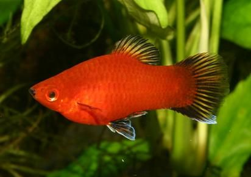

# Images Segmentation Using Fuzzy-C-means Algorithm

## Description

This repository contains a Python implementation of the Fuzzy C-Means clustering algorithm. The Fuzzy C-Means clustering algorithm is used for clustering data points into distinct clusters with a degree of membership for each point. In this project, we apply the FCM algorithm for image segmentation.

The challenge of implementing this algorithm involves dealing with complex mathematical concepts and ensuring accurate calculations for degrees of membership across clusters. This makes the algorithm more adaptable to real-world data, which often contains overlapping clusters.

### Theoretical Background

The `fuzzy c-mean clustering` differs from `k-mean clustering` in that each sample in the data has a degree of membership to all clusters. This degree is represented as a real number in the range [0,1], where the sum of the degrees of membership for each sample across all clusters is equal to 1.

The `fuzzy c-mean clustering` is more aligned with human reasoning and logic. For instance, in a high-dimensional space, it is natural for some samples to be outliers, situated between two or more clusters. In such cases, their membership values will fall between 0 and 1 for multiple clusters.

## Results

- *Figure 1: The original image*

- *Figure 2: Segmented image with 3 clusters*

- *Figure 3: Segmented image with 6 clusters*

[Documentaion](https://drive.google.com/file/d/1E3CZ2qQElXbE3OsOfW5mbrpU9qpVp1Eu/view?usp=sharing) (in Arabic)
